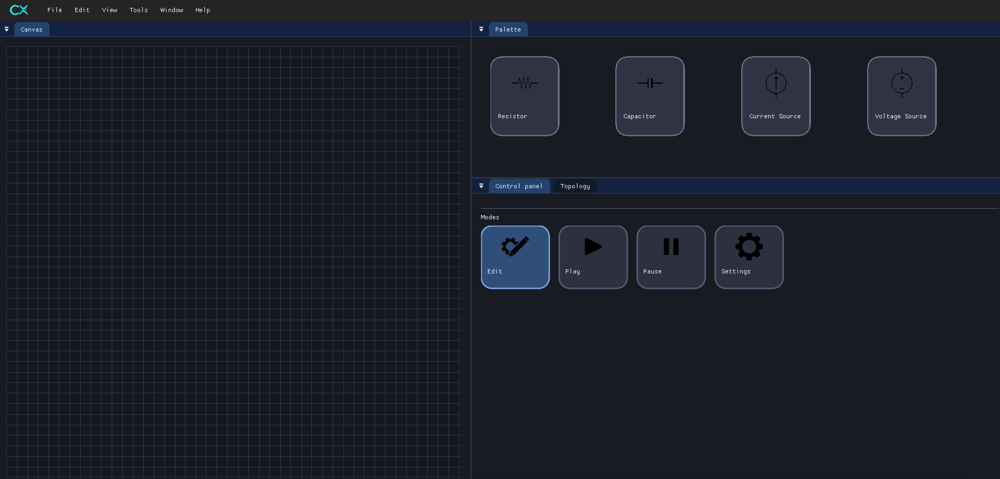
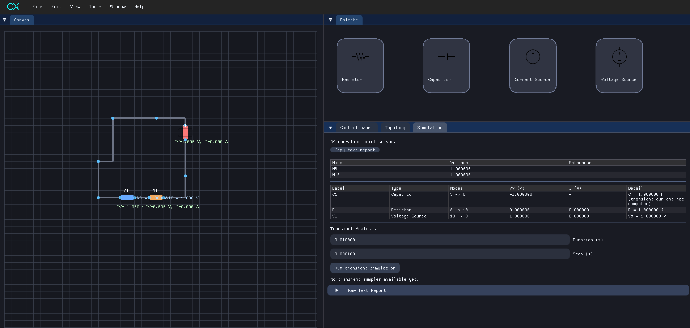
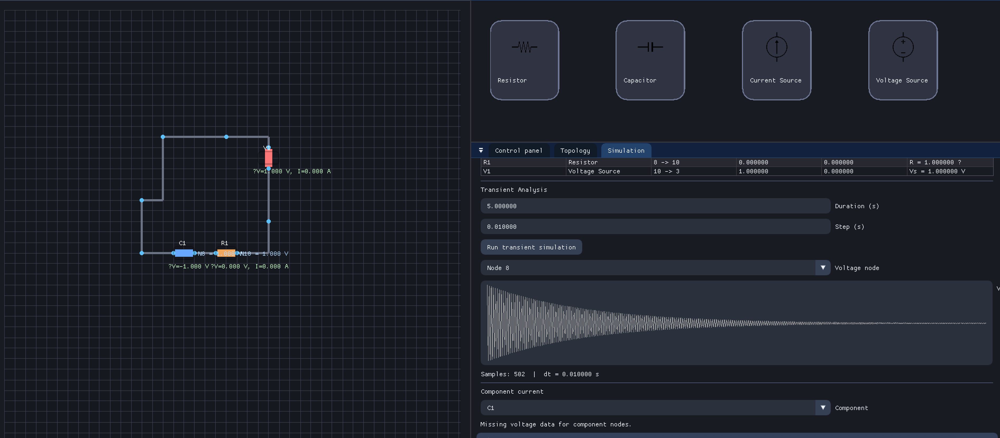
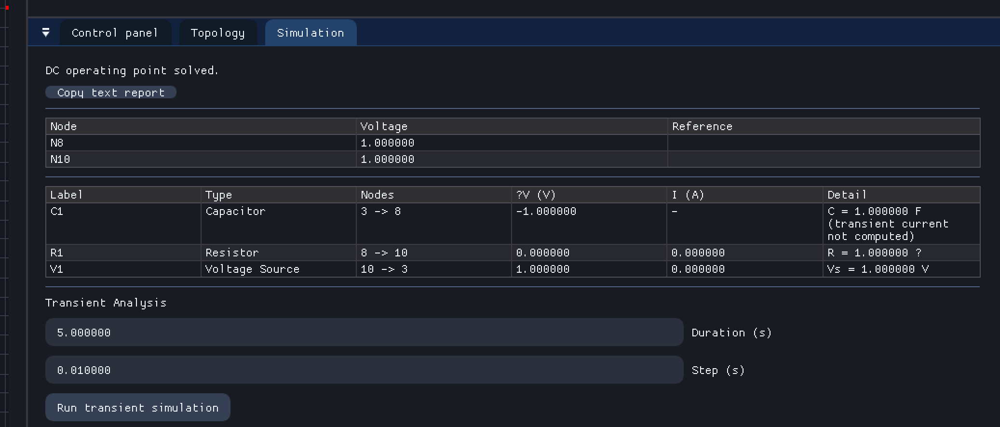

# CircuitX


CircuitX is a modern circuit editor and simulator built with C++26, SFML, ImGui-SFML, Eigen, and nlohmann/json. It provides a polished graphical editor (with ImGui-driven panels) backed by a modular solver that uses per-element stamping handlers to assemble Modified Nodal Analysis (MNA) systems.

## Features

- **Rich editor UI**: Canvas with grid snapping, palette drag-and-drop, contextual toolbox, properties panel, simulation results, and transient plotting – all componentized for clarity.
- **Modular solver**: Each electrical element (resistor, voltage source, current source, capacitor) has its own stamping handler, simplifying future component additions.
- **Transient analysis**: Basic capacitor support with backward-Euler discretization and sample buffers for plotting voltage/current traces.
- **Extensive asset & panel infrastructure**: Asset manager for textures, UI panels for palette/toolbox/control/settings/simulation/properties/topology views.

## Project Structure

```
circuitx/
├─ app/                 # Application entry point, UI services, helpers, panels
├─ res/                 # UI textures and other assets
├─ solver/              # Circuit solver library (public headers + stamping modules)
├─ docs/                # Documentation (architecture overview, TODOs, etc.)
└─ CMakeLists.txt       # Build configuration (FetchContent + targets)
```

See [`docs/architecture.md`](docs/architecture.md) for a deep dive into each subsystem.

## Building

CircuitX uses CMake and FetchContent to pull its dependencies.

```bash
cmake -S . -B build
cmake --build build
```

> **Note:** First-time builds require network access so FetchContent can clone SFML, ImGui-SFML, Eigen, and nlohmann/json.

## Running

After building, the primary executable (`app`) lives under `build/`. Launch it to open the editor window:

```bash
./build/app/app
```

Use the palette to drag components onto the canvas, wire them up, and run simulations via the control panel.

## Screenshots

| Palette & Canvas | Simulation Panels |
| --- | --- |
|  |  |

| Transient Plots | Properties/Toolbox |
| --- | --- |
|  |  |

## Contributing

1. Fork and clone the repository.
2. Create a feature branch.
3. Follow the established coding style (C++26, guarded headers, minimal includes).
4. Keep UI changes modular – prefer adding new panels/services rather than inflating existing ones.
5. Submit a PR referencing any related issues.

## License

See [LICENSE](LICENSE) for details.
